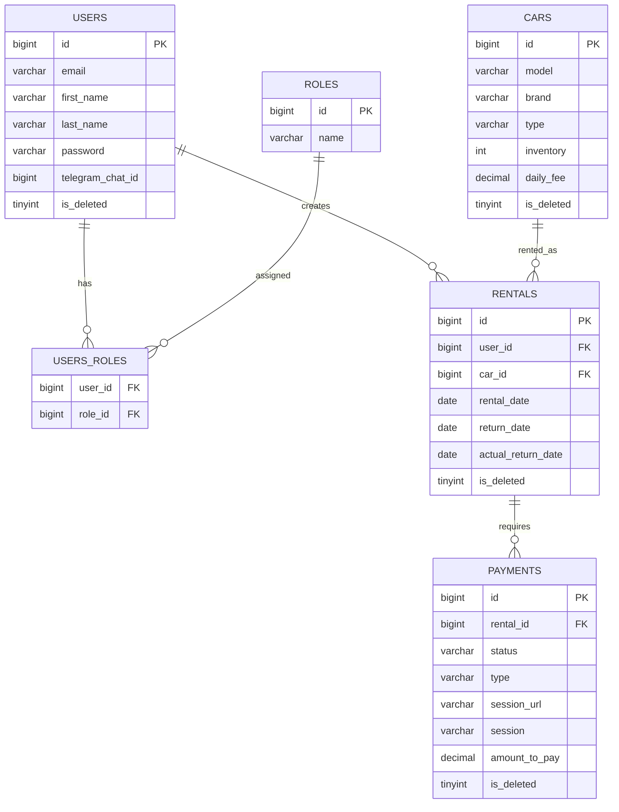

# 🚗 CarSharing API

**Modern Car Rental Management System** - A comprehensive Spring Boot REST API designed for efficient car sharing services, featuring role-based access control, rental management, and integrated payment processing.

> *Built with enterprise-grade architecture and modern development practices, this project delivers a complete solution for car sharing businesses seeking scalable and secure rental management.*

---

## 💡 Project Inspiration

Car sharing services are revolutionizing urban mobility, requiring sophisticated backend systems that can handle complex rental workflows, payment processing, and fleet management. This project addresses the need for a **production-ready car sharing platform** that demonstrates modern Spring Boot development excellence.

**The Challenge**: Create a comprehensive car rental system that manages the entire rental lifecycle - from car inventory to payment processing - while ensuring security, scalability, and operational efficiency.

**The Solution**: A meticulously designed REST API with role-based access control, integrated payment processing via Stripe, and comprehensive rental management capabilities that can scale from local car sharing to enterprise fleet management.

---

## ✨ Project Overview

CarSharing API is a complete car rental management platform that provides everything needed to operate a modern car sharing service. From user authentication to payment processing, this system handles the entire rental workflow while providing powerful management tools for fleet operators.

**Perfect for:** Car sharing businesses, mobility startups, fleet management companies, educational projects, and as a foundation for larger transportation platforms.

---

## 🎯 Core Features

### 🔐 **Authentication & Authorization**
- **JWT-based authentication** with secure token management
- **Role-based authorization** (CUSTOMER/MANAGER privileges)
- **Password encryption** using BCrypt
- **Session management** with configurable token expiration

### 🚙 **Fleet Management**
- **Complete CRUD operations** for car inventory
- **Car type classification** (SEDAN, SUV, HATCHBACK, UNIVERSAL)
- **Inventory tracking** and availability management
- **Soft delete implementation** for data integrity
- **Daily fee configuration** per vehicle

### 📄 **Rental Management**
- **End-to-end rental workflow** from booking to return
- **Active rental tracking** and status monitoring
- **Flexible rental periods** with date validation
- **Late return handling** and fee calculation
- **User-specific rental history**

### 💳 **Payment Processing**
- **Stripe integration** for secure payment handling
- **Multiple payment types** (PAYMENT, FINE)
- **Payment session management** with success/cancel handling
- **Payment status tracking** (PENDING, PAID)
- **Automated fine calculation** for late returns

### 👤 **User Profile Management**
- **Comprehensive user profiles** with contact information
- **Telegram integration** for notifications
- **Profile update capabilities** (full and partial)
- **Role management** for administrative control

---

## 🛠️ Technology Stack

### **Backend Framework**
| Technology | Version | Purpose |
|-----------|---------|---------|
| **Spring Boot** | 3.x | Core application framework |
| **Spring Security** | Latest | Authentication & authorization |
| **Spring Data JPA** | Latest | Data persistence layer |
| **Java** | 17+ | Programming language |

### **Database & Persistence**
| Technology | Purpose |
|-----------|---------|
| **MySQL** | Production database |
| **H2 Database** | Testing environment |
| **Hibernate** | ORM with advanced features |
| **Liquibase** | Database migrations |

### **Payment & External Services**
| Technology | Version | Purpose |
|-----------|---------|---------|
| **Stripe API** | Latest | Payment processing |
| **Telegram Bot API** | Latest | User notifications |

### **Security & Authentication**
| Technology | Version | Purpose |
|-----------|---------|---------|
| **JWT** | 0.12.x | Token-based authentication |
| **BCrypt** | Latest | Password hashing |

### **Development Tools**
| Technology | Version | Purpose |
|-----------|---------|---------|
| **MapStruct** | 1.5.x | Object mapping automation |
| **Lombok** | Latest | Code generation & boilerplate reduction |
| **Maven** | Latest | Build automation & dependency management |
| **Swagger/OpenAPI 3** | Latest | Interactive API documentation |
| **Docker** | Latest | Application containerization |

### **Testing & Quality**
| Technology | Version | Purpose |
|-----------|---------|---------|
| **JUnit 5** | Latest | Modern testing framework |
| **Mockito** | Latest | Mocking for unit tests |
| **Testcontainers** | Latest | Integration testing |
| **MockMvc** | Latest | Spring MVC testing |

---

## 🗄️ Database Architecture

### **Entity Relationship Diagram**



### **Key Database Features**
- **Soft Delete Pattern**: All major entities (Users, Cars, Rentals, Payments) include `is_deleted` boolean flag
- **Foreign Key Constraints**: Proper relationships enforced at database level
- **Data Integrity**: NOT NULL constraints and unique indexes where appropriate
- **Audit Trail**: Telegram chat ID support for notification tracking
- **Payment Security**: Separate session URL and session ID fields for Stripe integration

### **Sample Data Initialization**
The database includes pre-loaded test data for immediate development and testing:
- **2 Users**: Manager and Customer with encrypted passwords
- **2 Roles**: ROLE_MANAGER and ROLE_CUSTOMER
- **User-Role Associations**: Manager assigned ROLE_MANAGER, Customer assigned ROLE_CUSTOMER

#### 🔑 Test Accounts
| Role | Email | Password | Access Level |
|------|-------|----------|--------------|
| **Manager** | manager@example.com | `securePassword123` | Full system access |
| **Customer** | customer@example.com | `securePassword123` | Rental operations |

#### 🚗 Sample Fleet
| Model | Brand | Type | Daily Fee |
|-------|-------|------|-----------|
| **Camry** | Toyota | SEDAN | $45.00 |
| **RAV4** | Toyota | SUV | $65.00 |
| **Civic** | Honda | HATCHBACK | $40.00 |

---

## 📌 API Endpoints

### **Authentication Endpoints**
| Method | Endpoint | Description | Access |
|--------|----------|-------------|---------|
| `POST` | `/auth/register` | Register new user account | 🌍 Public |
| `POST` | `/auth/login` | User login (returns JWT) | 🌍 Public |

### **Car Management**
| Method | Endpoint | Description | Access |
|--------|----------|-------------|---------|
| `GET` | `/cars` | Get paginated car list | 👤 Customer |
| `GET` | `/cars/{id}` | Get car details by ID | 👤 Customer |
| `POST` | `/cars` | Add new car to fleet | 🔧 Manager |
| `PUT` | `/cars/{id}` | Update car information | 🔧 Manager |
| `DELETE` | `/cars/{id}` | Remove car from fleet | 🔧 Manager |

### **Rental Management**
| Method | Endpoint | Description | Access |
|--------|----------|-------------|---------|
| `POST` | `/rentals` | Create new rental | 👤 Customer |
| `GET` | `/rentals/{id}` | Get rental details | 👤 Customer |
| `GET` | `/rentals` | Get rentals by user & status | 👤 Customer |
| `POST` | `/rentals/{id}/return` | Return rented vehicle | 👤 Customer |

### **Payment Management**
| Method | Endpoint | Description | Access |
|--------|----------|-------------|---------|
| `POST` | `/payments` | Create payment session | 👤 Customer |
| `GET` | `/payments` | Get payment history | 👤 Customer |
| `GET` | `/payments/success/{sessionId}` | Handle payment success | 👤 Customer |
| `GET` | `/payments/cancel/{sessionId}` | Handle payment cancellation | 👤 Customer |

### **User Profile Management**
| Method | Endpoint | Description | Access |
|--------|----------|-------------|---------|
| `GET` | `/users/me` | Get current user profile | 👤 Customer |
| `PUT` | `/users/me` | Full profile update | 👤 Customer |
| `PATCH` | `/users/me` | Partial profile update | 👤 Customer |
| `PUT` | `/users/{id}/role` | Update user role | 🔧 Manager |

---

## 🚀 Quick Start Guide

### **Prerequisites**
- ☕ **Java 17** or higher
- 🔧 **Maven 3.6+**
- 🗄️ **MySQL 8.0+**
- 🐳 **Docker** (optional, recommended)
- 💳 **Stripe Account** (for payment processing)

### **Installation Steps**

#### 1. Clone the Repository
```bash
# HTTPS
git clone https://github.com/carsharingorg/car-sharing-app.git

# SSH (if you have SSH keys configured)
git clone git@github.com:carsharingorg/car-sharing-app.git

# Navigate to project directory
cd car-sharing-app
```

#### 2. Configure Environment Variables
Create `.env` file:
```env
# Database Configuration
MYSQL_DATABASE=carsharing
MYSQL_USER=carsharing_user
MYSQL_PASSWORD=secure_password
MYSQL_ROOT_PASSWORD=root_password

# Application Configuration
SPRING_LOCAL_PORT=8080
MYSQL_LOCAL_PORT=3307

# JWT Configuration
JWT_SECRET=your-super-secret-jwt-key
JWT_EXPIRATION=86400000

# Stripe Configuration
STRIPE_SECRET_KEY=sk_test_your_stripe_secret_key
STRIPE_PUBLISHABLE_KEY=pk_test_your_stripe_publishable_key

# Telegram Bot (Optional)
TELEGRAM_BOT_TOKEN=your_telegram_bot_token

# Application Configuration
APP_BASE_URL=http://localhost:8080
APP_FINE_MULTIPLIER=1.5
```

#### 3. Docker Setup (Recommended)
```bash
# Start with Docker Compose (includes MySQL)
docker-compose up -d

# Verify containers are running
docker-compose ps

# View application logs
docker-compose logs -f app
```

#### 4. Manual Setup (Alternative)
```bash
# Clean and install dependencies
mvn clean install

# Run the Spring Boot application
mvn spring-boot:run
```

---

## 🧪 Testing Strategy

### **Comprehensive Testing Suite**
Multi-layered testing approach ensuring system reliability:

#### **Testing Technologies**
- **JUnit 5** - Modern testing framework
- **Mockito** - Unit test mocking
- **Testcontainers** - Integration testing with real databases
- **MockMvc** - Web layer testing
- **Spring Security Test** - Authentication testing

#### **Test Categories**
| Test Type | Purpose | Technology |
|-----------|---------|------------|
| **Unit Tests** | Service layer logic | JUnit 5 + Mockito |
| **Integration Tests** | Repository & database | Testcontainers |
| **Controller Tests** | REST endpoints | MockMvc + Security |
| **Payment Tests** | Stripe integration | Mocked external calls |

#### **Running Tests**
```bash
# All tests
mvn test

# Specific test categories
mvn test -Dtest="*RepositoryTest"     # Database tests
mvn test -Dtest="*ControllerTest"     # API tests
mvn test -Dtest="*ServiceTest"        # Business logic tests

# Integration tests with Testcontainers
mvn test -Dtest="*IntegrationTest"

# Test with coverage
mvn clean test jacoco:report
```

---

## 📖 API Documentation & Testing

### **Interactive Documentation**
Once the application is running, access comprehensive API documentation at:
- **Swagger UI**: `http://localhost:8080/swagger-ui.html`
- **OpenAPI Specification**: `http://localhost:8080/v3/api-docs`

### **Authentication for API Testing**
1. Register a new user or use test credentials
2. Login to receive JWT token
3. Add token to Authorization header: `Bearer <your-jwt-token>`

---

## 🏗️ Architecture & Design

### **Layered Architecture Pattern**
```
┌─────────────────────────────────┐
│      REST Controllers          │ ← API endpoints & request handling
├─────────────────────────────────┤
│       Service Layer            │ ← Business logic & transactions
├─────────────────────────────────┤
│     Repository Layer           │ ← Data access & persistence  
├─────────────────────────────────┤
│       Entity Models            │ ← Database mapping & relationships
└─────────────────────────────────┘
```

### **Key Design Principles**
- ✅ **DTO Pattern** - Clean API communication
- ✅ **Repository Pattern** - Data access abstraction
- ✅ **Service Layer** - Business logic encapsulation
- ✅ **Soft Delete** - Data integrity preservation
- ✅ **JWT Stateless** - Scalable authentication
- ✅ **Event-Driven** - Notification system integration
- ✅ **Payment Gateway** - External service integration

---

## 🔒 Security Features

| Security Layer | Implementation | Benefit |
|----------------|---------------|---------|
| **Password Security** | BCrypt hashing | Secure credential storage |
| **Authentication** | JWT tokens | Stateless, scalable auth |
| **Authorization** | Role-based access | Granular permission control |
| **Input Validation** | Bean Validation | Data integrity protection |
| **Payment Security** | Stripe integration | PCI-compliant processing |
| **Data Protection** | Soft delete pattern | Recovery & audit capabilities |

---

## 💳 Payment Processing

### **Stripe Integration Features**
- **Secure Payment Sessions** - PCI-compliant payment processing
- **Multiple Payment Types** - Regular payments and fines
- **Webhook Support** - Real-time payment status updates
- **Success/Cancel Handling** - Complete payment flow management
- **Payment History** - Transaction tracking and reporting

### **Payment Flow**
1. **Session Creation** → Stripe checkout session
2. **User Redirect** → Secure Stripe payment page
3. **Payment Processing** → Stripe handles payment
4. **Status Update** → Webhook updates payment status
5. **Confirmation** → User receives payment confirmation

---

## 🔧 Key Business Logic

### **Rental State Management**
The system automatically manages rental states based on dates:
- **Active Rental**: `actualReturnDate` is null
- **Completed Rental**: `actualReturnDate` is not null
- **Overdue Rental**: Current date > `returnDate` and `actualReturnDate` is null

### **Inventory Management**
- Car inventory decreases when rental is created
- Car inventory increases when rental is returned
- Prevents double bookings through inventory validation

### **Payment Calculation**
- **Regular Payment**: `dailyFee × rentalDays`
- **Fine Payment**: `dailyFee × overdueDays × fineMultiplier`

### **Automated Notifications**
- **Rental Created**: Notifies user of successful booking
- **Rental Returned**: Confirms vehicle return
- **Overdue Rentals**: Daily check at 8:00 AM for late returns

---

## 🚀 Production Deployment

### **Pre-deployment Checklist**
- [ ] Configure production Stripe keys
- [ ] Set up production database connection
- [ ] Update JWT secret for production
- [ ] Configure SSL/TLS certificates
- [ ] Set up application logging and monitoring
- [ ] Configure Telegram bot for notifications
- [ ] Implement database backup strategy
- [ ] Set up health checks and monitoring

### **Environment Configuration**
```bash
# Production environment variables
export SPRING_DATASOURCE_URL="jdbc:mysql://prod-db:3306/carsharing"
export SPRING_DATASOURCE_USERNAME="carsharing_user"
export SPRING_DATASOURCE_PASSWORD="secure_production_password"
export JWT_SECRET="production-strength-secret-key-min-256-bits"
export STRIPE_SECRET_KEY="sk_live_your_production_stripe_key"
export TELEGRAM_BOT_TOKEN="your_production_bot_token"
export APP_BASE_URL="https://your-domain.com"
```

---

## 🤝 Contributing

We welcome contributions from the community! Here's how you can help:

### **Development Workflow**
1. **Fork** the repository
2. **Create** a feature branch: `git checkout -b feature/amazing-feature`
3. **Follow** existing code style and patterns
4. **Add** comprehensive tests for new functionality
5. **Commit** with descriptive messages: `git commit -m 'Add amazing feature'`
6. **Push** to branch: `git push origin feature/amazing-feature`
7. **Open** a Pull Request with detailed description

### **Development Standards**
- ✅ Follow Java naming conventions and best practices
- ✅ Use Lombok annotations to reduce boilerplate
- ✅ Write comprehensive tests (unit + integration + controller)
- ✅ Maintain test coverage above 80%
- ✅ Use Testcontainers for integration testing
- ✅ Follow existing DTO patterns and layered architecture
- ✅ Ensure proper error handling and validation

---

## 👨‍💻 Contact & Support

**Developer**: Vladyslav Bedryk
- 🔗 **GitHub**: [@vbedryk](https://github.com/vbedryk)
- 💼 **LinkedIn**: https://www.linkedin.com/in/vladyslav-bedryk-9a39b4193

**Project Repository**: [CarSharing API on GitHub](https://github.com/carsharingorg/car-sharing-app)

**Support**: For questions and support, please open an issue on GitHub or contact the development team.

---

## 📝 License

This project is licensed under the MIT License - see the [LICENSE](LICENSE) file for details.

---

*Built with ❤️ for modern mobility solutions*
